# Ocean Invaders

## Project Information

- **Course:** CSX4515 Game Design and Development (Section 542, 1/2026)
- **Group:** Ocean Invaders
- **Team members:** Sai Aike Shwe Tun Aung and Ekaterina Kazakova

<p align="center">
  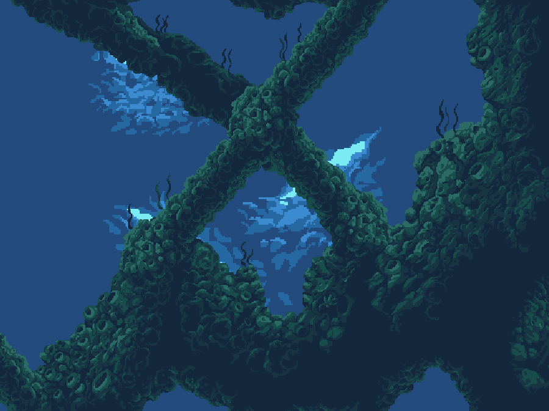
</p>

**Ocean Invaders** is an underwater side-scrolling shooter built in Java for
the CSX4515 Game Design and Development pre-midterm project. It takes the
movement, enemy waves, upgrades, and escalating combat of a retro space
shooter and moves them beneath the surface: the player is a fish, the shots
are bubbles, and the final threat is a giant Anglerfish.

The world scrolls continuously while the player moves freely around the
viewport, avoids terrain and hazards, defeats sea-creature enemies, and
collects temporary power-ups across two stages and a boss encounter.

## Highlights

- Four-direction movement with tap-or-hold bubble shooting
- Two scrolling stages followed by a multi-attack Anglerfish boss
- Five enemy types with distinct movement, attack, hurt, and death behavior
- Five power-ups, including stackable speed and multi-shot upgrades
- Mines with chain reactions, destructible coral, and solid cave terrain
- Scene-specific music and event-driven sound effects
- Scripted and random spawning modes for development and level design
- External CSV terrain and event files
- Alpha-aware terrain collision derived from the visible tile artwork
- Configurable hitbox overlays, stage timers, transitions, and gameplay values
- Browser-based level editor and sprite-clipping tool

## Controls

### Gameplay

| Action | Keys |
|---|---|
| Move | `WASD` or Arrow Keys |
| Shoot | `Space` |
| Pause or resume | `Escape` |

### Menus

| Screen | Key | Action |
|---|---|---|
| Title | `1` | Start from Stage 1 |
| Title | `2` | Start from Stage 2 for development |
| Title | `Q` | Quit |
| Pause | `R` | Restart from Stage 1 |
| Pause | `M` | Return to the main menu |
| Pause | `Q` | Quit |
| Game over / Victory | `Enter` | Return to the main menu |

Menus use direct keyboard commands rather than cursor-based navigation.

## Player

The player animation is clipped from the main fish character sheet and
flipped at runtime to face the direction of fire.

| Animated preview | Source frames | Role |
|---|---|---|
| 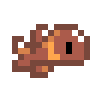 | 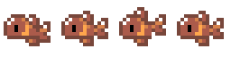 | Move freely through the viewport, fire bubbles, collect upgrades, and survive all three encounters. |

## Power-Ups

Power-ups drift with the world and float vertically as they move. Speed can
remain active alongside one weapon upgrade, while collecting a different
weapon replaces the current weapon mode.

| Icon | Power-up | Effect |
|---|---|---|
| 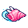 | **Speed Up** | Raises movement speed. Stacks up to two levels. |
| 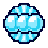 | **Multi-shot** | Fires rapid bursts. Stacks up to four levels, producing three to six bubbles per burst. |
|  | **Mega-shot** | Fires one larger bubble that deals increased damage. |
| 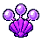 | **Split-shot** | Fires three parallel bubbles at different vertical offsets. |
|  | **Heal** | Restores one HP without exceeding the player's maximum health. |

## Enemies

The animated previews use the same frame order, orientation, and relative
timing as the game. The adjacent static image is the original source sheet
used for that animation.

| Animated preview | Source sprite sheet | Enemy | Behavior |
|---|---|---|---|
| 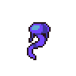 | 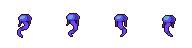 | **Jellyfish** | Drifts left while floating up and down. |
| 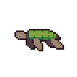 | 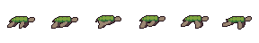 | **Turtle** | A durable enemy that continuously swims toward the player. |
| 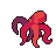 | 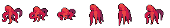 | **Octopus** | Swims with the current and throws rocks during its attack animation. |
| 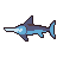 | 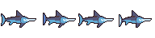 | **Swordfish** | Telegraphs its attack, then rushes toward the player's recorded position. |
| 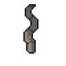 | 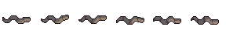 | **Snake** | Emerges from cave terrain and attacks vertically from the top or bottom. |
| 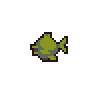 | 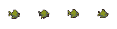 | **Bomber Fish** | Tracks the player after being summoned and explodes when its timer expires. |
| 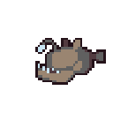 | 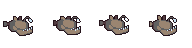 | **Anglerfish** | Uses a tracking bubble stream, a dash-bite, and summoned Bomber Fish. |

## Stages

### Stage 1: Minefield

The opening stage introduces the scrolling ocean, Jellyfish, Turtles, and
explosive mines. Mine blasts can damage nearby entities and trigger other
mines, creating chain reactions.

### Stage 2: Deep Caves

The cave stage adds solid terrain, breakable coral, Octopuses, Swordfish, and
Snakes. The player must fight while navigating a tighter path between the
cave floor and ceiling.

### Boss: Anglerfish

Scrolling stops for the final encounter. At half health, the Anglerfish
enters its second phase and attacks more frequently. Defeating it completes
the run.

## Getting Started

### Requirements

- JDK 17 or newer
- A desktop environment capable of running Java Swing

No external Java libraries or build system are required.

### Compile and Run

From the repository root:

```bash
javac -d out $(find src/gdd -name '*.java')
java -cp out gdd.Main
```

The project can also be opened and run from IntelliJ IDEA. Keep the repository
root as the working directory because game assets and level files use
repository-relative paths.

## Development Tools

### Level Editor

Open [`tools/level-editor/index.html`](tools/level-editor/index.html) in a
browser to build scripted stages visually. The editor supports:

- Terrain painting with real game tiles and multi-cell footprints
- Enemy, obstacle, and power-up placement on a time-based level layout
- Exact static viewport previews
- Undo and redo
- Validation for terrain coverage, tile placement, and stage-specific events
- CSV import and export compatible with the Java runtime

See the [level editor guide](tools/level-editor/README.md) and
[level format reference](tools/level-editor/LEVEL_FORMAT.md) for details.

Run its model tests with:

```bash
node tools/level-editor/test-editor.mjs
```

### Sprite Clipper

Open [`tools/sprite-clipper/index.html`](tools/sprite-clipper/index.html) to
mark animation frames on a sprite sheet, preview the animation, and export
Java `Rectangle` declarations for the game's sprite system.

See the [sprite clipper guide](tools/sprite-clipper/README.md) for the full
workflow.

## Project Structure

```text
src/
├── audio/                 WAV music and role-based sound effects
├── gdd/
│   ├── level/             CSV loading, tile definitions, and terrain collision
│   ├── powerup/           Power-up behavior and weapon modes
│   ├── scene/             Title, gameplay, boss, and end scenes
│   ├── spawn/             Scripted and random spawning
│   └── sprite/            Player, projectiles, enemies, and obstacles
├── images/                Backgrounds, sprite sheets, tiles, and effects
└── levels/                Terrain and timed event CSV files

resources/                 Specification, implementation plan, and course material
test/                      Java model and rendering tests
tools/
├── level-editor/          Visual stage authoring tool
└── sprite-clipper/        Sprite-sheet frame clipping tool
```

## Project Documentation

- [Project specification](resources/PROJECT_SPECIFICATION.md)
- [Implementation plan](resources/IMPLEMENTATION_PLAN.md)
- [Original idea dump](resources/Side-Scroller%20Project%20Ideadump.md)

The specification defines the intended game behavior. The implementation
plan records the technical approach, while this README remains the practical
overview for players and contributors.

## Team

- [sasta-kro](https://github.com/sasta-kro) (Sai Aike Shwe Tun Aung)
- [kari-nami](https://github.com/kari-nami) (Ekaterina Kazakova)

## Asset Attribution

| Use | Source |
|---|---|
| Player fish sprites | [Cute Fish Sprites on OpenGameArt](https://opengameart.org/content/cute-fish-sprites) |
| Main enemies and Anglerfish | [Octopus, Jellyfish, Shark and Turtle pack by CraftPix](https://craftpix.net/freebies/octopus-jellyfish-shark-and-turtle-free-sprite-pixel-art/) |
| Bomber fish | [Underwater Enemies pack by CraftPix](https://craftpix.net/freebies/free-underwater-enemies-pixel-art-character-pack/) |
| Explosion effects | [Ring Explosion on OpenGameArt](https://opengameart.org/content/ring-explosion) |
| Stage 1 environment | [Underwater Mines Pixel Background on OpenGameArt](https://opengameart.org/content/underwater-mines-pixel-background) |
| Stage 2 environment | [Underwater Diving Pack on OpenGameArt](https://opengameart.org/content/underwater-diving-pack) |
| Player bubble sound effects | [Bubbles](https://opengameart.org/content/bubbles) and [Skippy Fish Water Sound Collection](https://opengameart.org/content/skippy-fish-water-sound-collection) |
| Scene 1 music | [Frenzied Swimming](https://opengameart.org/content/frenzied-swimming) |
| Menu and Scene 2 music | [Aquaria](https://opengameart.org/content/aquaria) |
| Death music | [Underwater-like Fanfare](https://opengameart.org/content/underwater-like-fanfare) |
| Player hurt and Octopus rock effects | *The Legend of Zelda*, Koji Kondo, Nintendo (1987) |
| Snake attack effect | *Castlevania*, Konami (1987) |
| Victory music | *Final Fantasy III*, Square (1990) |
| Temporary boss music and assorted effects | [Gradius II NES soundtrack and sounds](https://www.zophar.net/music/nintendo-nes-nsf/gradius-ii?ct=1785154631481) |

Third-party artwork and audio remain subject to their original authors'
licenses and terms.

## Acknowledgements

This project extends the course starter repository,
[mchayapol/gdd-space-invaders-project](https://github.com/mchayapol/gdd-space-invaders-project),
which is based on Jan Bodnar's
[Java Space Invaders](https://github.com/janbodnar/Java-Space-Invaders)
tutorial project.
